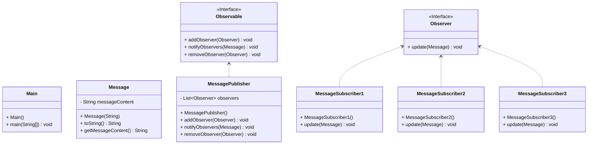

```mermaid
classDiagram
direction BT
class Main {
  + Main() 
  + main(String[]) void
}
class Message {
  + Message(String) 
  - String messageContent
  + toString() String
  + getMessageContent() String
}
class MessagePublisher {
  + MessagePublisher() 
  - List~Observer~ observers
  + addObserver(Observer) void
  + notifyObservers(Message) void
  + removeObserver(Observer) void
}
class MessageSubscriber1 {
  + MessageSubscriber1() 
  + update(Message) void
}
class MessageSubscriber2 {
  + MessageSubscriber2() 
  + update(Message) void
}
class MessageSubscriber3 {
  + MessageSubscriber3() 
  + update(Message) void
}
class Observable {
<<Interface>>
  + addObserver(Observer) void
  + notifyObservers(Message) void
  + removeObserver(Observer) void
}
class Observer {
<<Interface>>
  + update(Message) void
}

MessagePublisher  ..>  Observable 
MessageSubscriber1  ..>  Observer 
MessageSubscriber2  ..>  Observer 
MessageSubscriber3  ..>  Observer 
```